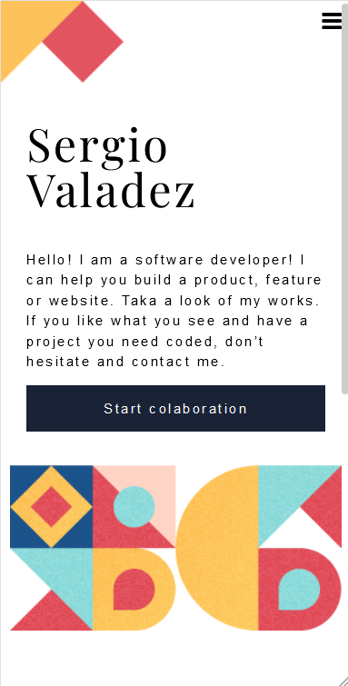

# My work portfolio

This project has the intention to be a kind of CV regarding my
Information Technology skills. To build it i just used HTML, CSS, and JavaScript Vanilla flavor. Not that I don't know
how to work with them. Each one of the items on the section Projects has been carefully selected
in order to convey a clear idea about my skills. The idea is that this page reflects what I have 
done and how do I understand this great digital world we all live in. 

Additional description about the project and its features.

## Built With

- Major languages: HTML, CSS, JavaScript, GIT
- Frameworks: None. 
- Technologies used: github, vscode, WebStorm, windows 10 & kubuntu 21.10
- Protocols: https, nft, tcp
## Live Demo

Click here to see the [live demo](https://sergiogval.github.io).

## Getting Started

To get a local copy up and running follow these simple example steps.

### Prerequisites
A PC with a Windows 10 or Linux Ubuntu operating system. It has to have GIT installed.

### Setup
Go to the following site and clone the repository (https://github.com/sergiogval/sergiogval.github.io)
## Author

### Sergio Valadez

- GitHub: [@sergiogval](https://github.com/sergiogval/)
- Tweeter [@srgvldz](https://twitter.com/srgvldz)
- LinkedIn [@Sergio_Valadez](https://www.linkedin.com/in/sergio-valadez-282153216/)

## 🤝 Contributing

Contributions, issues, and feature requests are welcome!

Feel free to check the [issues page]().
<!-- TODO: include the proper link --->

## Show your support

Give a ⭐️ if you like this project!

## Acknowledgments

- Hat tip to anyone whose code was used
- Inspiration
- etc

## 📝 License

This project is [MIT](./MIT.md) licensed.
